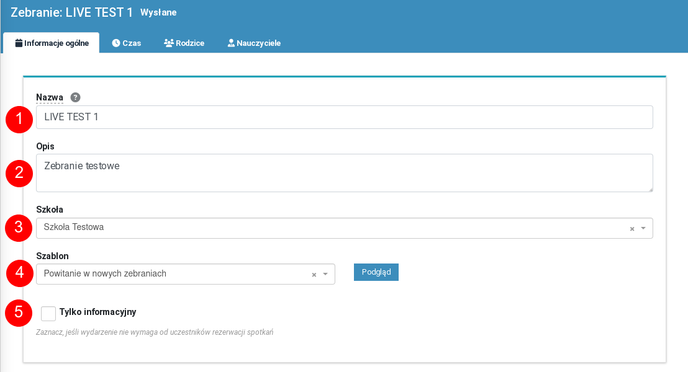
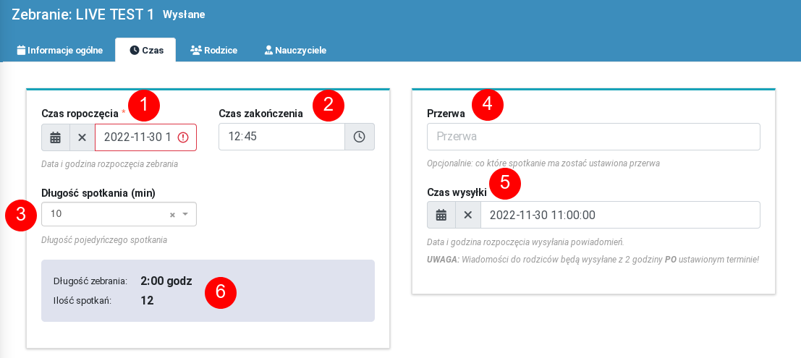
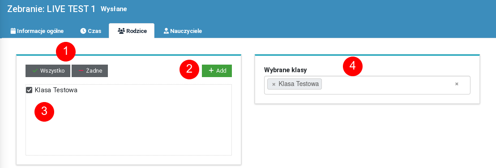
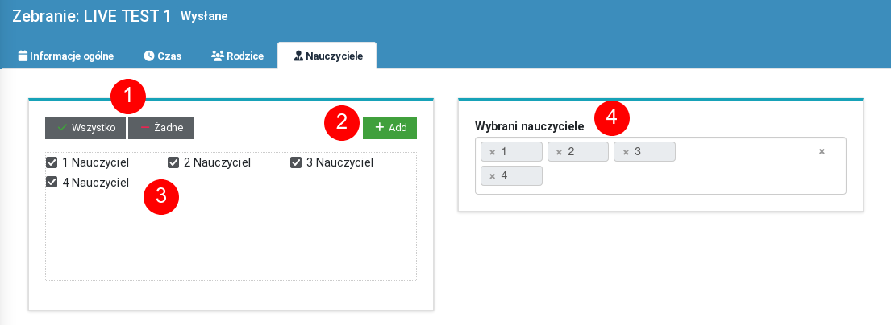

# Zebrania

## Informacje ogólne

## Tworzenie nowego zebrania

Informacje niezbędne do stworzenia nowego zebrania zgrupowane sa na czterech ekranach.
Pierwszy ekran zawiera podstawowe informacje dotyczące zebrnia:

1. Nazwa zebrania [wymagane]- nazwa służaca głównie do łatwej identyfikacji zebrania w systemie
2. Opis zebrania [opcjonalne] 
3. Wybór szkoły, której dotyczy zebrania. Pozwala na wynranie rodziców i nauczycieli z klas związanych z tą szkołą na dalszym etapie edycji.

1. Data i godzina rozpoczęcia zebrania
2. Godzina zakończenia zebrania. Po tej godzinie nie będą tworzone nowe spotkania.
3. Długość pojedyńczego spotkania
4. Co które spotkanie ma zostać automatycznie ustawiona przerwa w systemie rezerwacji. Np. wpisanie 4 oznacza, że po każdych 3-ech spotkaniach, kolejny przedział czasowy zostanie zarezerwowany jako przerwa. Opcja ta dotyczy wszystkich prowadzących, biorących  udział w zebraniu. Oczywiście, każdy z prowadzących może indywidualnie zmienić (odblokować) ustalone w ten sposób przerwy.
5. Godzina o której ma rozpocząć się wysyłka zaproszeń. 
	1. **Uwaga!** Prowadzący (nauczyciele) otrzymają powiadomienia z 2-u godzinnym wyprzedzeniem, tak aby mieli czas na indywidualne dopasowanie swojego kalendarza spotkań (np. ustalenie przerw). 
	2. Ustawienie terminu wysyłka na datę przeszłą (np. na wczoraj) będzie skutkowało wysłaniem powiadomień natychmiast po zakolejkowaniu zebrania do wysyłki.
6. Pole pokazujące jak długo będzie trwało spotkanie i ile spotkań (bez przerw) będzie maksymalnie możliwych w ramach ustalonych godzin (pola 1, 2 i 3)

